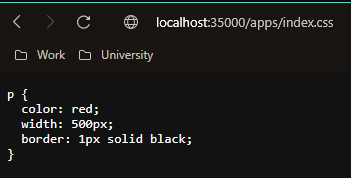
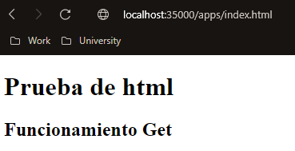
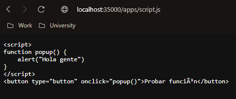
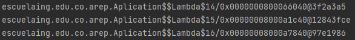
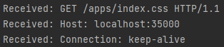

# Taller # 3
## MICROFRAMEWORKS WEB

### Nombre: David Arturo Narváez Lossa

Para este ejercicio usted deb construir un  servidor web para soportar una funcionalidad similar a la de Spark. Su aplicación debe permitir por lo menos el registro de servicios get y post usando funciones lambda. Implemente igualmente funciones que le permitan configurar el directorio de los archivos estáticos, y otra que permita cambiar el tipo de la respuesta a "application/json". Para esto solo debe usar el API básico de Java. No utilice frameworks como Spark o Spring.
### Requerimientos:

Tener instalado maven, entorno de desarrollo para el lenguaje (java) repositorio de git (https://github.com/Art2416/Aplicaciones-distribuidas-dise-o-y-estructuracion.git)

### Ejecución del programa

* Para ejecutar lo primero es clonar el repositorio (https://github.com/Art2416/MICROFRAMEWORKS-WEB.git). 
* Poner en ejecución el servidor web ya sea desde mvn iniciando la clase (Aplicación).
* Ingresar desde el navegador (mozila preferiblemente).
* En la barra de búsqueda ingresar http://localhost:35000
* Para ingresar a cada uno de los servicios creados ingrese:
    1. http://localhost:35000/apps/index.html
  2. http://localhost:35000/apps/index.css
  3. http://localhost:35000/apps/script.js
* En cada uno de estos se está empleando funcionamiento del get con la función lambda  
## Ejecuciones 

### Información adicional

* la documentación se puede generar desde maven con su respectivo comando
* El diseño del software es extensible tanto en funcionalidades como en realizar consultas a otra API o implementacion de nuevos servicios
* Emplea patrones (Singleton)
* Emplea principios (Single responsability)
