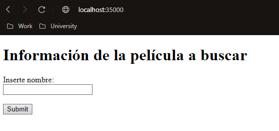
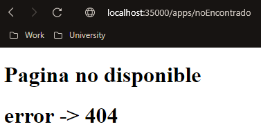

# Taller # 2
## TALLER DISEÑO Y ESTRUCTURACIÓN DE APLICACIONES DISTRIBUIDAS EN INTERNET

### Nombre: David Arturo Narváez Lossa

Escriba un servidor web que soporte múlltiples solicitudes seguidas (no concurrentes). El servidor debe leer los archivos del disco local y retornar todos los archivos solicitados, incluyendo páginas html, archivos java script, css e imágenes. Construya una aplicación web con  javascript, css, e imágenes para probar su servidor. Incluya en la aplicación la comunicación asíncrona con unos servicios REST en el backend. NO use frameworks web como Spark o Spring, use solo Java y las librerías para manejo de la red.
### Requerimientos:

Tener instalado maven, entorno de desarrollo para el lenguaje (java) repositorio de git (https://github.com/Art2416/Aplicaciones-distribuidas-dise-o-y-estructuracion.git)

### Ejecución del programa

* Para ejecutar lo primero es clonar el repositorio (https://github.com/Art2416/Aplicaciones-distribuidas-dise-o-y-estructuracion.git). 
* Poner en ejecución el servidor web ya sea desde mvn iniciando la clase (Aplicación).
* Ingresar desde el navegador (mozila preferiblemente).
* En la barra de búsqueda ingresar http://localhost:35000
* Para ingresar a cada uno de los servicios creados ingrese:
    1. http://localhost:35000/apps/index.html
  2. http://localhost:35000/apps/index.css
  3. http://localhost:35000/apps/script.js
  4. http://localhost:35000/apps/noEncontrado
  
## Ejecuciones 

### Información adicional

* la documentación se puede generar desde maven con su respectivo comando
* El diseño del software es extensible tanto en funcionalidades como en realizar consultas a otra API o implementacion de nuevos servicios
* Emplea patrones (Singleton)
* Emplea principios (Single responsability)
